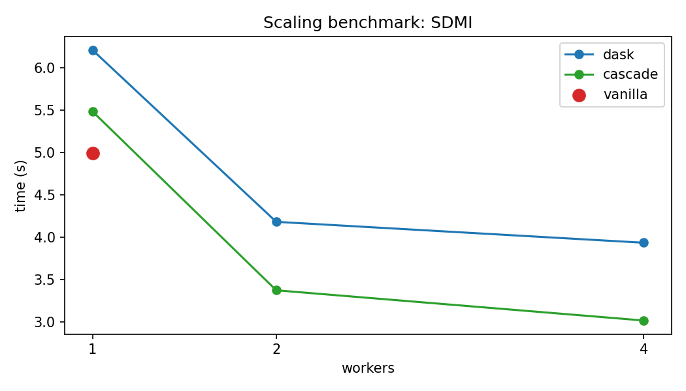
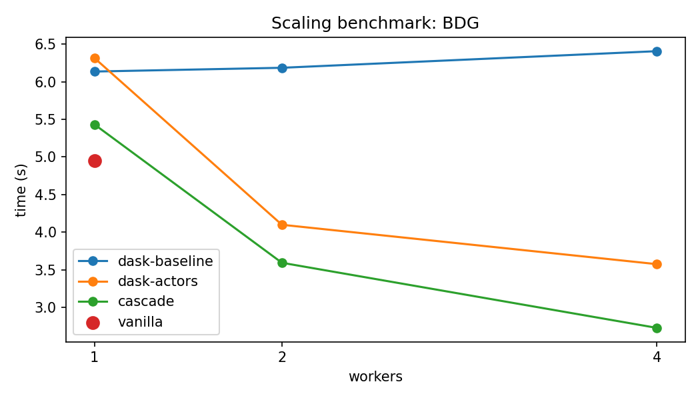

# EGU26 Benchmarks: Cascade vs Dask

## Purpose

This benchmark suite was written for EGU26 to showcase particular features and
strengths of the Cascade distributed execution engine relative to Dask.

**This is not a fair general-purpose benchmark.**  Neither implementation was
hand-tuned by a framework expert: both were written by an AI agent following a
similarly detailed prompt (the `spec-*.md` files in this directory), so in that
sense the playing field is level.  The scenarios were chosen deliberately to
highlight areas where Cascade's programming model is especially ergonomic or
efficient.

The bigger context is Weather Forecasting -- Cascade's home turf.  Most
numerical weather prediction problems do not fit the classical MapReduce
decomposition where Dask shines.  The two benchmarks below are synthetic
proxies for patterns that arise constantly in practice.

The implementations were derived from `spec-dask-01.md` (Dask entrypoints) and
`spec-cascade-02.md` (Cascade entrypoints and file layout).


## Benchmarks

### SDMI -- Single Data, Multiple Instructions

One source task generates a shared N x N matrix.  M child tasks each receive
that same matrix and independently compute a heavyweight operation (SVD of the
matrix scaled by the child index, returning the nuclear norm).

**What it shows:** In Dask, the matrix is serialised and sent to each worker
separately over the local socket.  In Cascade, workers that share a host can
read the output directly from shared memory, avoiding redundant copies.  This
matters in practice whenever a single model state (analysis field, grid
snapshot) needs to fan out to many independent post-processing tasks.

### BDG -- Batch Data Generation

A source generator yields M matrices one at a time, with a deliberate
sequential dependency (each matrix is the element-wise product of a fresh
random matrix and the previous one) and an optional sleep between yields.
Each matrix is then independently post-processed (SVD nuclear norm) and the
results are summed.

Three implementations are provided:

- **dask-baseline** -- wasteful: the source generates all M matrices at once
  before any child can start.
- **dask-actors** -- pipelined: a Dask Actor holds the generator state and
  hands matrices out one at a time, allowing child SVD tasks to run
  concurrently with generation.  This requires understanding Dask Actors, which
  are not a beginner concept, and has two non-obvious pitfalls documented in
  `spec-dask-01.md`.
- **cascade** -- pipelined with a plain `yield`: the source is an ordinary
  Python generator function; Cascade recognises it natively and schedules child
  tasks as each value is yielded.  No special API is needed.

**What it shows:** In Weather Forecasting, auto-regressive models yield
forecasts one time-step at a time (T+6h, T+12h, ...).  Post-processing of
earlier steps should begin as soon as they are available, without waiting for
the full forecast to complete.  Cascade treats this as a first-class pattern
("just yield"); Dask requires reaching for Actors.


## Running

```
uv run --with matplotlib harness.py <sdmi|bdg|all> <1w|2w|4w|all>
```

The harness always sets `BENCHMARK_NPTHREAD=1` to pin BLAS thread counts and
make worker scaling meaningful.  Default matrix sizes and child counts are set
per scenario; override with `BENCHMARK_N`, `BENCHMARK_M`, `BENCHMARK_T`.

A **vanilla** sequential Python implementation (no framework, plain for-loops)
is also included for each scenario.  It runs once and appears as a single dot
on the plots.  At 1 worker it shows the raw compute cost and, by comparison
with the framework runs at 1 worker, reveals each framework's scheduling
overhead.


## Results

Measured on a personal laptop (16-core) for a basic picture.  An HPC cluster
environment would introduce network latency, distributed storage, and
multi-GPU interactions that would complicate the comparison considerably.

Settings: N=1000, M=16, T=0 (no sleep), BLAS threads=1 per worker.

### SDMI

| implementation | 1 worker | 2 workers | 4 workers |
|----------------|----------|-----------|-----------|
| vanilla        | 4.99 s   | --        | --        |
| dask           | 6.21 s   | 4.18 s    | 3.93 s    |
| cascade        | 5.48 s   | 3.37 s    | 3.02 s    |

Cascade is faster at every scale point.  Both frameworks show modest speedup
from 2 to 4 workers because N=1000 SVDs are already memory-bandwidth bound on
this machine.



### BDG

| implementation   | 1 worker | 2 workers | 4 workers |
|------------------|----------|-----------|-----------|
| vanilla          | 4.95 s   | --        | --        |
| dask-baseline    | 6.13 s   | 6.18 s    | 6.41 s    |
| dask-actors      | 6.31 s   | 4.10 s    | 3.58 s    |
| cascade          | 5.43 s   | 3.59 s    | 2.73 s    |

The baseline does not scale at all -- it holds all matrices in the source task
before releasing any work.  Actors unlock pipelining but at 1 worker they show
overhead from actor coordination.  Cascade matches actors at 2 workers and
pulls ahead at 4, while requiring no special API.


