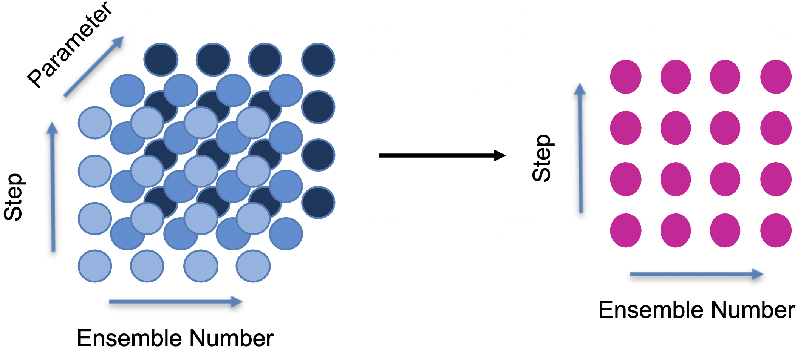

Introduction
============

Cascade has three main components:
- **Fluent** defines the language for constructing task graphs and the accompanying backend objects the graph operations on
- **Schedulers** for scheduling the task graphs based on task resource requirements
- **Executors** for executing the task graph 

Fluent
------

The function cascading API for constructing graphs consists low level methods such as:
- ``reduce``
- ``join`` 
- ``broadcast``
- ``expand``
- ``transform``
- ``map``
- ``flatten``

which operate on the array of nodes in the graph, creating new nodes, and return another action object. 

The figure below shows a ``Action.reduce`` operation on a three-dimensional array of nodes over the `parameter`
dimension, which returns ``Action`` containing a two-dimensional array of nodes on the right-hand side.
<center>

</center>

Most of the methods require a ``Payload`` which specifies the function and its arguments that is being applied on the array of nodes. For example, for ``Action.reduce`` the signature is 
```python
def reduce(self, payload: Payload, dim: str = "") -> "Action":
```
where an example could be 
```python
payload = Payload(lambda x, y, z: x**2 + y**2 + z**2)
```
applied across the `parameter` dimension.

The `Fluent` class is for defining the `Action` that defines the graph construction language. 

Example usage is:
```python
from cascade.fluent import Fluent, Action

fluent = Fluent(Action)
```

The ``Fluent`` class provides a ``source`` method for creating the initial node array by specifying a function and its args and kwargs. For example to create a single node that opens a xarray dataset
```python
import xarray as xr 
from cascade.fluent import Fluent

initial_action = Fluent().source(xr.open_dataset, args=("/path/to/dataset",), kwargs={})
```
To create multiple nodes, at least one of the arguments to `source` either the function, args or kwargs must be a xr.DataArray. For example, 
```python
import numpy as np 
from cascade.fluent import Fluent

args = [np.fromiter([(2, 3) for _ in range(2)], dtype=object) for _ in range(2)]
initial_action = fluent.source(np.random.rand, args)
```
In this case, `initial_action` would contain a (2, 2) array of nodes with dimension "x" and "y", each containing (2, 3) random numpy array. If multiple DataArrays are passed for the function, args or kwargs then they match in shape, coords and dims.

One can then construct a graph from this point using the function cascading API:
```python
from cascade.fluent import Fluent, Payload

graph = (
    Fluent().source(np.random.rand, args)
    .mean("x")
    .min("y")
    .expand("z", 3, 1, 0)
    .map([Payload(lambda x, a=a: x * a) for a in range(1, 4)])
    .graph()
)
```

Resources 
---------

The graphs constructing using the Fluent API do not contain any annotations for resource usage of the tasks in each node. To manually attach resources to the tasks, we transform the graph into a ``TaskGraph`` object, providing a dictionary of `Resources`, containing CPU cost and memory, for each node name. 
```python
from cascade.transformers import to_taskgraph
from cascade.taskgraph import Resources

task_graph = to_taskgraph(graph, {
    x.name: Resources(100, 50) for x in graph.nodes()
})
```
Alternatively, if ``None`` is provided instead of a dictionary, the graph is executed using
a thread pool and the CPU cost and memory are measured using a resource meter and attached to the resulting ``TaskGraph`` object. 


Schedulers
----------

The schedulers assign the tasks in the graph to workers according to a ``ContextGraph`` and the resource requirements of the tasks in the ``TaskGraph``. Currently, two schedulers are available:
- ``DepthFirstScheduler``: assigns tasks according using a similated run of execution proceeding via a depth
first traversal of the graph
- ``AnnealingScheduler``: schedules the graph using a simulated annealing algorithm, with the initial 
schedule determined by the ``DepthFirstScheduler``


Executors
---------

The available executors are based on the Dask distributed local executor and Kubernetes executor. Both have been adapted to either use the dynamic scheduler provided by Dask or execute according to a provided schedule. 

**Does not currently create workers according to ``ContextGraph``** 

To execute a graph using the ``DaskLocalExecutor``, do the following:
```python
from cascade.executors.dask import DaskLocalExecutor

results = DaskLocalExecutor(n_workers=2, threads_per_worker=1, processes=True,
    memory_limit="10G").execute(graph)
```
The ``graph`` variable can be ``Graph`` or a ``Schedule``. If a ``Schedule`` is provided, then the 
executor will modify the task graph in order for Dask to execute it according to the predefined 
schedule. The method returns a dictionary of node names and associated contents of the sinks in the 
graph.

The execution also produces a Dask performance report, which is a html file containing information about the resources used during the run and a task stream for each worker. 

