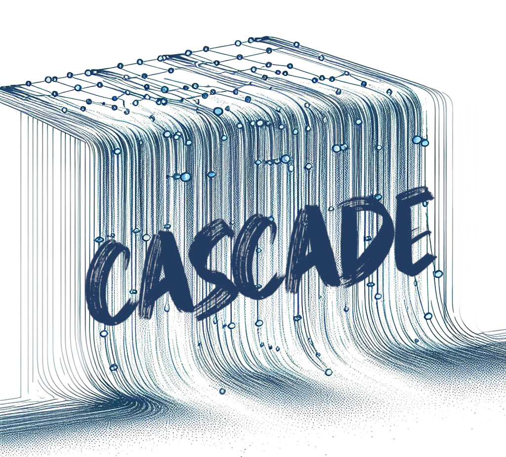

> **DISCLAIMER**
> This project is **BETA** and will be **experimental** for the foreseeable future. Interfaces and functionality are likely to change, and the project itself may be scrapped. **DO NOT** use this software in any project/software that is operational.

Cascade is designed to execute task graphs optimally across heterogeneous platforms with complex network technologies and topologies. It effectively performs task-based parallelism across CPUs, GPUs, distributed systems (HPC), and any combination thereof. It is designed for a no-IO approach, where expensive storage of intermediate data is minimised whilst maximising all available transport technologies between different hardware.

Cascade is designed to work on well-profiled task graphs, where:
* the task graph is a static DAG
* the DAG nodes are defined by tasks with well-known execution times
* the DAG edges are defined by data dependencies with well-known data sizes
* the characteristics of the hardware (processors, network connections) are known

There are two main components to Cascade:

## The Executor

The executor is responsible for executing the plan created by the scheduler on the target hardware. Each executor should be capable of simulating its execution plan.

## The Scheduler

The scheduler is responsible for creating an execution plan for the DAG. For schedulers based on optimization, the scheduler is likely to use a simulated execution as a fitness function for the optimization.

## License

```
Copyright 2022, European Centre for Medium Range Weather Forecasts.

Licensed under the Apache License, Version 2.0 (the "License");
you may not use this file except in compliance with the License.
You may obtain a copy of the License at

    http://www.apache.org/licenses/LICENSE-2.0

Unless required by applicable law or agreed to in writing, software
distributed under the License is distributed on an "AS IS" BASIS,
WITHOUT WARRANTIES OR CONDITIONS OF ANY KIND, either express or implied.
See the License for the specific language governing permissions and
limitations under the License.

In applying this licence, ECMWF does not waive the privileges and immunities
granted to it by virtue of its status as an intergovernmental organisation
nor does it submit to any jurisdiction.
```